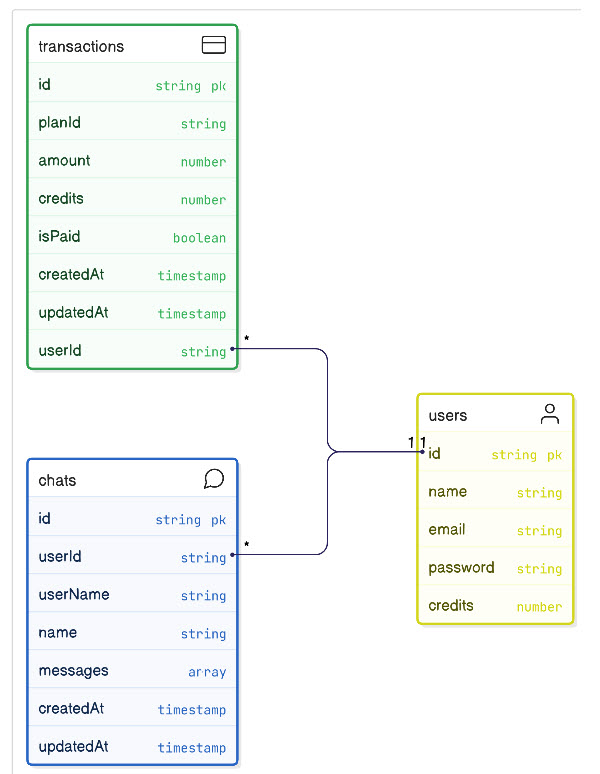

# AI Stomatology

[](https://nextjs.org/)
[](https://www.typescriptlang.org/)
[](https://www.prisma.io/)
[](https://tailwindcss.com/)

## 📝 Project Overview

**AI Stomatology** is a modern, full-stack web platform designed to streamline workflows in dental clinics and integrate Artificial Intelligence features to assist in diagnosis and patient management.

The project is built on the **Next.js** framework and uses **TypeScript** to ensure high reliability, scalability, and development efficiency.

[Site](https://ai-stomatology-sxidsvit.vercel.app/)

### 💡 Key Features

- **Appointment Scheduling:** A user-friendly calendar system for planning appointments and managing the doctors' schedules.
- **Data Security:** Robust authentication, role-based access control, and mechanisms to protect confidential medical data.
- **Responsive Interface:** A modern and intuitive user interface optimized for seamless use across various devices.

## 🛠 Tech Stack

The project is built using the following core technologies:

| Category                 | Technology       | Description                                                                                 |
| :----------------------- | :--------------- | :------------------------------------------------------------------------------------------ |
| **Frontend / Fullstack** | **Next.js 15+**  | React framework for Server-Side Rendering (SSR), Static Site Generation (SSG), and routing. |
| **Language**             | **TypeScript**   | Adds static typing to JavaScript for improved code quality and maintainability.             |
| **Styling**              | **Tailwind CSS** | A utility-first CSS framework for rapid and customizable design development.                |
| **Database / ORM**       | **Prisma**       | A modern ORM for connecting to and interacting with databases (e.g., PostgreSQL or SQLite). |
| **Tooling**              | **Biome**        | Used for fast and efficient code formatting and linting.                                    |

Highlights:

🏠 Modern Landing Page with gradients & images <br>
🔐 Authentication via Clerk (Google, GitHub, Email & Password) <br>
🔑 Email Verification (6-digit code) <br>
📅 Appointment Booking System <br>
🦷 3-Step Booking Flow (Dentist → Service & Time → Confirm) <br>
📩 Email Notifications for Bookings (Resend) <br>
📊 Admin Dashboard for Managing Appointments <br>
🗣️ AI Voice Agent powered by Vapi (Pro Plans only) <br>
💳 Subscription Payments with Clerk (Free + 2 Paid Plans) <br>
🧾 Automatic Invoices via Email <br>
💸 Smart Subscription Upgrades (pay only the difference) <br>
📂 PostgreSQL for Data Persistence <br>
🎨 Styling with Tailwind CSS + Shadcn <br>
⚡ Data Fetching with TanStack Query <br>
🤖 CodeRabbit for PR Optimizations <br>
🧑‍💻 Git & GitHub Workflow (branches, PRs, merges) <br>
🚀 Deployment on Sevalla (free-tier friendly) <br>

---


---

## 🚀 Getting Started

Follow these steps to set up and run the project locally.

### Prerequisites

Ensure you have the following installed:

- Node.js (version 18+)
- npm (or yarn/pnpm)
- Git

### Installation

1.  **Clone the repository:**

    ```bash
    git clone [https://github.com/sxidsvit/ai-stomatology.git](https://github.com/sxidsvit/ai-stomatology.git)
    cd ai-stomatology
    ```

2.  **Install dependencies:**

    ```bash
    npm install
    # or
    yarn install
    ```

3.  **Configure Environment Variables:**

    Create a file named `.env` in the project root and add the necessary variables, including the Prisma database connection string.

    ```bash
    NEXT_PUBLIC_CLERK_PUBLISHABLE_KEY=
    CLERK_SECRET_KEY=
    DATABASE_URL=
    NEXT_PUBLIC_VAPI_ASSISTANT_ID=
    NEXT_PUBLIC_VAPI_API_KEY=
    ADMIN_EMAIL=
    RESEND_API_KEY=
    NEXT_PUBLIC_APP_URL=http://localhost:3000
    ```

4.  **Prepare the Database:**



    Run the migrations to create the database schema structure.

    ```bash
    npx prisma migrate dev --name init
    ```

    _If necessary, add seeding data._

5.  **Run the Application:**
    ```bash
    npm run dev
    # or
    yarn dev
    ```

The application will be accessible at `http://localhost:3000`.

### 📬 Contact

Connect with the project maintainer:

[][linkedin]

[linkedin]: https://www.linkedin.com/in/sergiy-antonyuk/

#### 🙏 Acknowledgements

A heartfelt thank you to [Codesistency](https://www.youtube.com/@codesistency/) for his invaluable contributions
